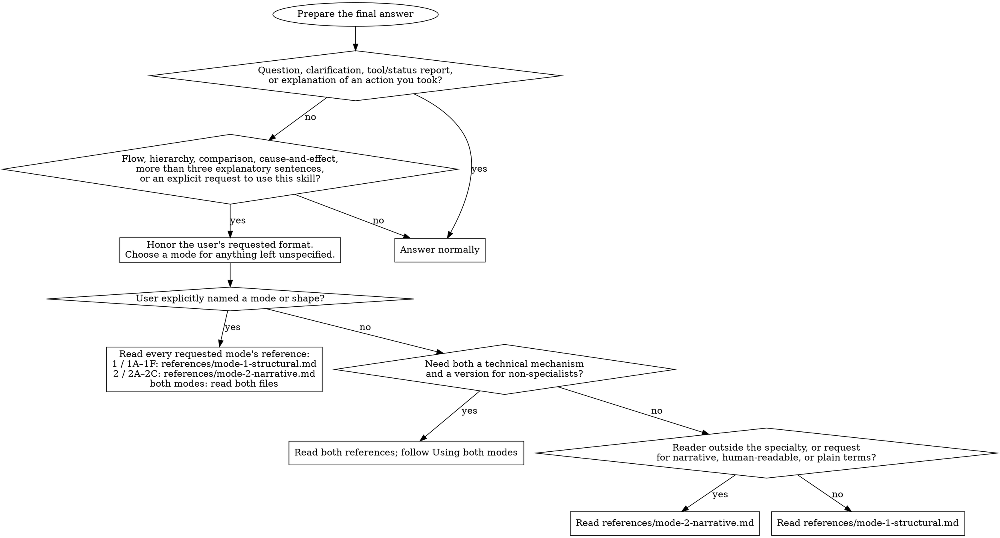

# Explain visually

Explain with plain language and diagrams. Follow the routing graph, then read
only the selected mode reference. DOT graphs are instructions for choosing an
answer format; they are not the diagrams to show the user.

## Choose a mode

The references are [Structural](references/mode-1-structural.md) and
[Narrative](references/mode-2-narrative.md). A request for plain terms alone
needs only Narrative; use both when the technical mechanism is also required.

With no argument, reissue your whole previous answer using this skill, keeping
its meaning and caveats. If it was only an excluded response, keep its normal
format. If there is no previous answer, ask what to explain.

## Shared rules

- The user's requested format overrides diagram and layout requirements,
  including those in the references. Follow the remaining content rules.
- Otherwise, draw relationships even in short answers. Restructure more than
  three explanatory prose sentences into a shape with brief supporting text.
- Open with one sentence of context, then show the relationship the user asked
  about. Ground claims in the available code, evidence, or stated scenario;
  distinguish inference from observation. Do not invent facts or branches.
- Explain unfamiliar domain terms inline with a dash or parentheses. Keep the
  term when useful, and skip definitions the reader already knows. Familiarity
  depends on the audience, not a fixed list of technical words.
- Keep unknown, assumed, and disputed points visible. Structural uses `(?)`,
  `(assumed)`, and `(disputed)`; Narrative states the uncertainty in words.
- End when the explanation is complete, without a summary that repeats it.
  These layout rules govern the final answer; required host progress messages
  can precede it.

## Using both modes

Show the mechanism first in a Structural shape, then its meaning for the reader
in a Narrative shape. Give each a short heading and choose their shapes
independently. Each part follows its mode's rules; avoid repeating details
that add nothing for the second audience.

## Rendering and examples

Read [diagram tooling](references/diagram-tooling.md) before drawing boxes or
columns. It covers [the renderer](scripts/diagrams.py), absolute paths,
validation limits, and the Python-unavailable fallback. Use the host's execution
and approval mechanism; Claude's `allowed-tools` metadata is not a permission
grant in another host.

[Worked examples](../../EXAMPLES.md) show every shape and both modes together.
Read the relevant example when a shape's compact pattern is not enough.
