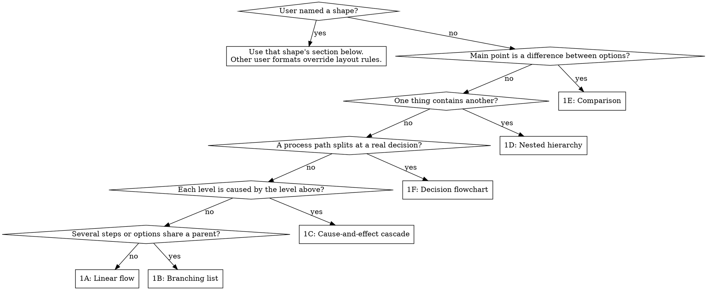

# Structural explanation

Read with [the shared rules](../SKILL.md#shared-rules). This mode shows a
mechanism to a reader familiar with the specialty. Use concise labels and
identifiers where they help trace the real system. Start at the request,
question, or input, then follow the relationships outward.

## Choose a shape



Use the matching section below. When an answer contains distinct relationships,
combine shapes for those parts rather than forcing everything into one.
Patterns here are fragments; full answers add the context and grounding
specified in the shared rules.

## 1A: Linear flow

Show a sequence without branches. Label an arrow when the reason or trigger
matters: `Input -> Check -(accepted)-> Next step`.

[Article publication example](../../../EXAMPLES.md#1a-linear-flow).

## 1B: Branching list

Put one parent above its steps or options. Order children by execution or by
the decision being considered, and state conditional steps explicitly.

```text
Parent
  -> first step
  -> if condition holds: optional step
  -> unresolved option (?)
```

[Support intake example](../../../EXAMPLES.md#1b-branching-list).

## 1C: Cause-and-effect cascade

Indent an effect beneath its cause. Siblings are separate effects of the same
cause. An action list belongs in 1B; a sequence alone does not prove causation.
Mark a proposed causal link `(assumed)` and an unmeasured effect `(?)`.

```text
Cause
  -> effect
     -> downstream effect
  -> another effect (?)
```

[Warehouse outage example](../../../EXAMPLES.md#1c-cause-and-effect-cascade).

## 1D: Nested hierarchy

Use containment for components inside a system or evidence supporting a claim.
Render inner boxes first, then pass their output into the outer box. For sibling
boxes, use matching content widths. See [nesting](diagram-tooling.md#nesting).

Pattern: an outer component box contains its child component boxes; position
does not imply execution order.

[Inventory hierarchy example](../../../EXAMPLES.md#1d-nested-hierarchy).

## 1E: Comparison

Rows describe the same attribute across options; columns contain short
fragments. Include each option's main unknown, or say when none is identified.
Generate a three-column layout with an empty header for row labels; see
[columns](diagram-tooling.md#columns). State the scenario's assumptions rather
than treating cost, reversibility, or suitability as universal properties.

Pattern: `Attribute | Option A | Option B`.

[Stock-check comparison](../../../EXAMPLES.md#1e-comparison).

## 1F: Decision flowchart

Use rounded boxes for starts and terminal states, rectangles for process steps,
and diamonds for decisions. Connect generated shapes with vertical lines and
arrows, and label each branch. A terminal state ends the path; a process step
may lead to another step.

Pattern: start → process → decision → labeled paths → terminal states.
Render the decision first: `diamond` accepts one line, so shorten its question
and align surrounding boxes to its width. See [boxes](diagram-tooling.md#boxes).

[Dispatch or backorder example](../../../EXAMPLES.md#1f-decision-flowchart).
