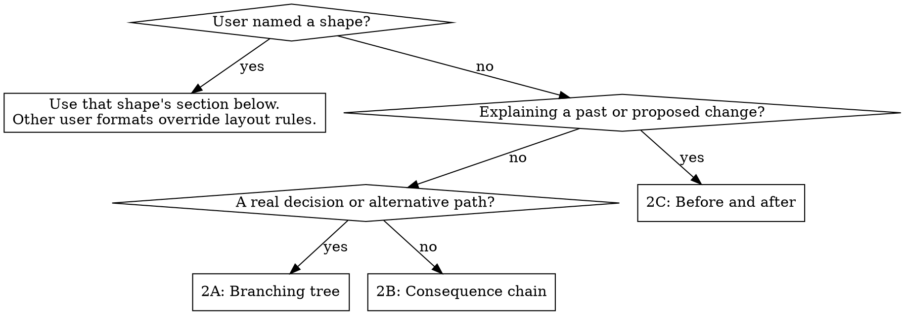

# Narrative explanation

Read with [the shared rules](../SKILL.md#shared-rules). Write for someone
outside the specialty: one idea per line, in full sentences. Name people and
what the system does instead of using class names, methods, variables, or
internal identifiers. State uncertainty in words.

## Choose a shape



Follow the matching section below; combine shapes when different parts of an
answer need them. Keep connectors as structure, with sentences as their content.
Only number steps when their sequence is the point.

## 2A: Branching tree

Walk through a process with a genuine fork. Use `┌─`, `├─`, and `└─`, indenting
sub-branches. Define the decision's condition when it may be unclear. Do not
invent a counterfactual branch for a result already known; use 2B instead.

```text
┌─ We reach a decision.
│
├─ If the condition holds, we take this path.
│   └─ This is its outcome.
│
└─ Otherwise, we take the other path.
    └─ This is what happens instead.
```

Trees are written directly; the box validator cannot check them.
[Appointment example](../../../EXAMPLES.md#2a-branching-tree).

## 2B: Consequence chain

Start with a finding or premise, then name the connection between each pair of
claims. Use `which means` for a consequence, `and better` or `and worse` for a
compounding effect, `because` for a reason, `but` for a limit, and `so` for an
action. Use `which would` for a conditional consequence and `we think` for an
unconfirmed link. A correlation needs an uncertainty statement, not a causal
connector.

```text
Starting fact.

  which means  A consequence follows.
  but          This limit still applies.
  we think     This possible link needs checking.

What would settle it
  The observation that would resolve the uncertainty.
```

Finish with the applicable block: `What would settle it`, `What we do next`,
or `What this costs us`. Keep it specific rather than restating the chain.
[Supplier delay example](../../../EXAMPLES.md#2b-consequence-chain).

## 2C: Before and after

Compare the same fact on each side, using full sentences. For past changes,
label columns `Before …` and `Since …`; for proposed changes, use `Today` and
`If we …`. If one side has no counterpart, explain that in words.

Pattern: context sentence, paired facts, then at least one relevant closing
block: `What did not change` / `What would not change`, `What we still do not
know`, or (for a proposal) `What could go wrong that does not today`.

Generate columns using [the tooling reference](diagram-tooling.md#columns).
When sentences would make the layout too wide, stack the two sides under their
own headings, keeping the facts in matching order.

[Appointment reminders example](../../../EXAMPLES.md#2c-before-and-after).
